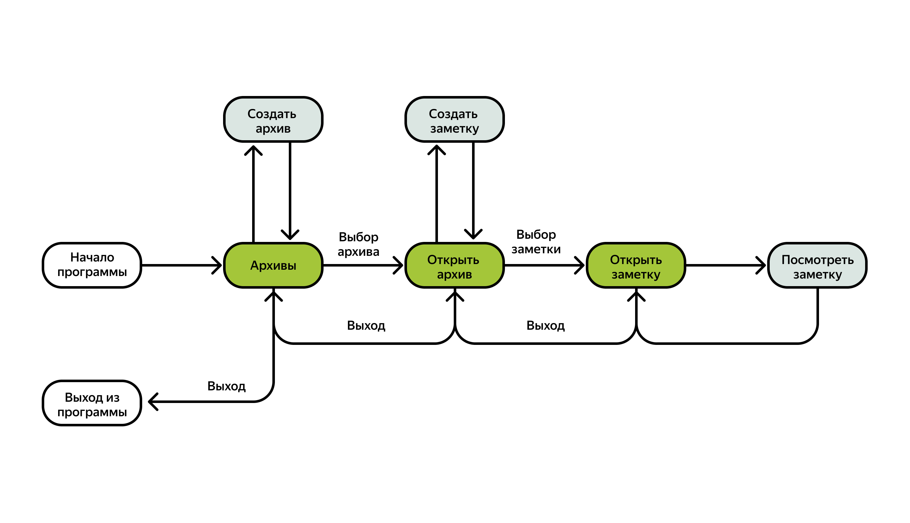

## Проектная работа - Стрим 7
### Консольное приложение №2

### Описание задания

Приложение «Заметки» должно иметь возможность:

* Добавлять архивы (наборы заметок);
* Добавлять заметки в архивы;
* Просматривать заметки.

Важно, чтобы пользователь мог в любой момент выйти с экрана выбора архива, заметок или заметки и попасть на предыдущий список.

Итого получится **пять экранов**:

1. Выбор архива.
2. Создание архива.
3. Выбор заметки.
4. Создания заметки.
5. Экран заметки. На экране заметки должна быть возможность вывода текста заметки.

Эти пять экранов условно разделим на **две группы**:

1. Выбор элемента из списка и создание объекта.
2. Выбор архива, выбор заметки, экран заметки — это меню выбора.

Например, выбор архива выглядит так:

    Список архивов:
    0. Создать архив
    1. Это мой уже созданный архив
    2. Выход

Такое количество экранов похоже на навигацию в реальном приложении — у пользователя всегда есть возможность выйти с любого экрана или пойти дальше.
Наша схема навигации выглядит так:

**Важно**: выход из программы есть только один. Во всех остальных случаях мы возвращаемся на предыдущий экран.

Выбор пункта меню на каждом экране должен корректно реагировать на неправильный ввод:

* Если человек ввёл не цифру, то программа должна сказать ему, что следует вводить цифру, и ещё раз показать пункты меню.
* Если человек ввёл цифру, но такого элемента нет на экране, то программа должна сказать, что такой цифры нет, снова показать пункты меню и предложить ввести корректный символ.